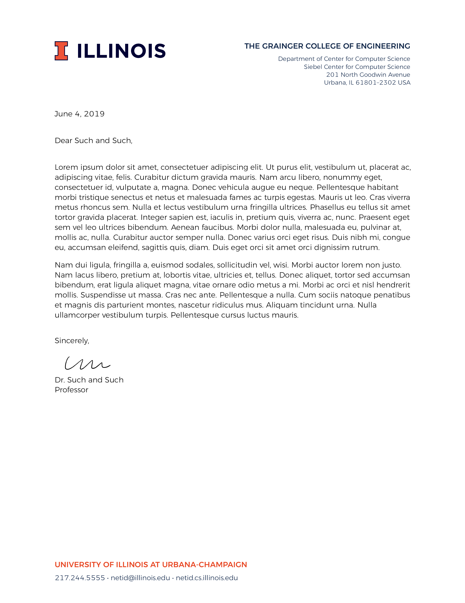

### What is this

This is an attempt to reproduce the Illinois letterhead in latex.  This will be updated when new guidelines are set.

### How to use

First install the Garamond URW fonts:
- For the garamond font, first download this script
```  
wget http://tug.org/fonts/getnonfreefonts/install-getnonfreefonts
```  
- Then install a script (!)
```    
sudo texlua install-getnonfreefonts
```    
- Then install the font
```
sudo getnonfreefonts-sys garamond
```
  or
```
sudo getnonfreefonts --sys garamond
```

- Then use `template.tex`.

### What it looks like



