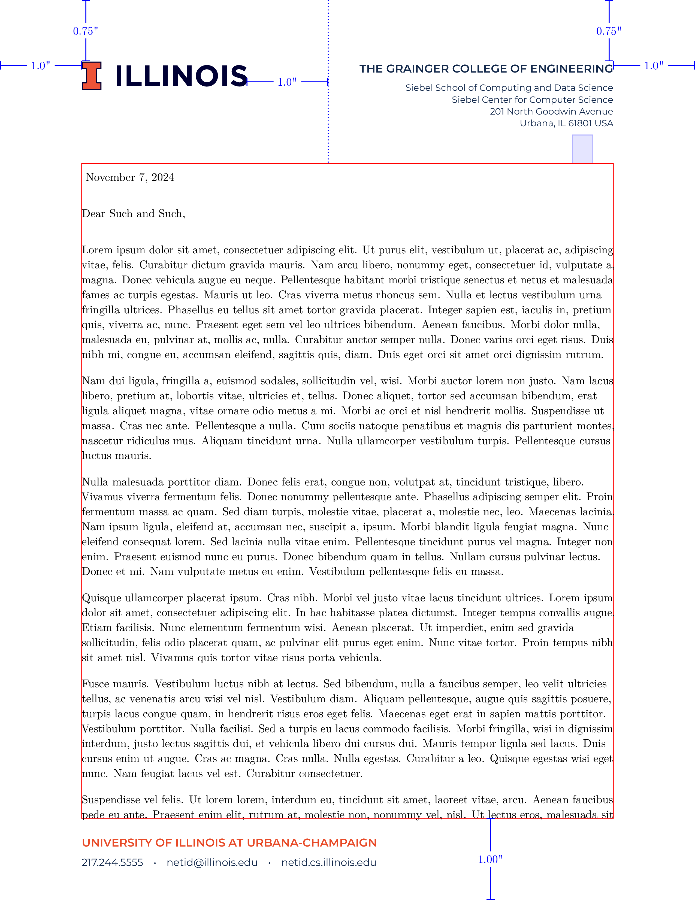

## What is this

This is an attempt to reproduce the Illinois letterhead in Latex.  This uses the new brand, the [block-I](http://creativeservices.illinois.edu/brand/).

This the *space-saving* format outline [here](https://creativeservices.illinois.edu/brand/pdf/stationery/letterhead.pdf).

If you are looking for the *old* I-mark style, you can find it in `imark` branch [here](https://github.com/lukeolson/illinois-letterhead/tree/imark).  There is also an original version of this template in the `blocki-basic` branch [here](https://github.com/lukeolson/illinois-letterhead/tree/blocki-basic).

## How to use

The official letterhead appears to use the [Gotham](https://www.typography.com/fonts/gotham/overview/) font.  A close available alternative is the [Montserrat](https://ctan.org/tex-archive/fonts/montserrat?lang=en) font, which is used here and is included in TexLive.

Start with `template.tex` and modify the preamble at the top, it includes the logo and font style through `illinois.tex`.

1. `cp template.tex myletter.tex`
2. write the letter
3. `pdflatex myletter.tex`

## What it looks like

[full pdf](./example/example.pdf)

## Details

You can see details of the formatting by uncommenting `\debugtrue` instead of `\debugfalse`.  Setting this shows the measurements similar to [here](https://creativeservices.illinois.edu/brand/pdf/stationery/letterhead.pdf).

