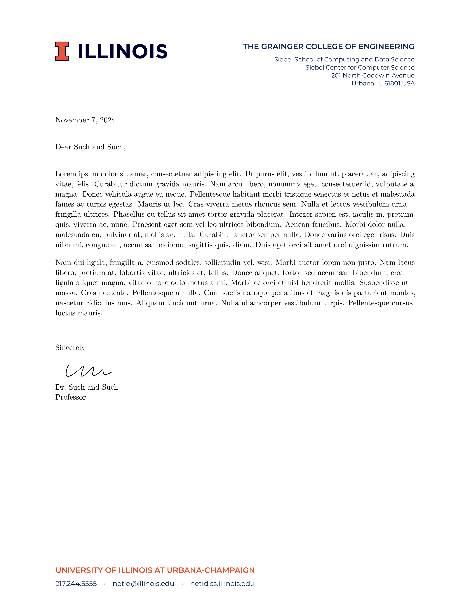
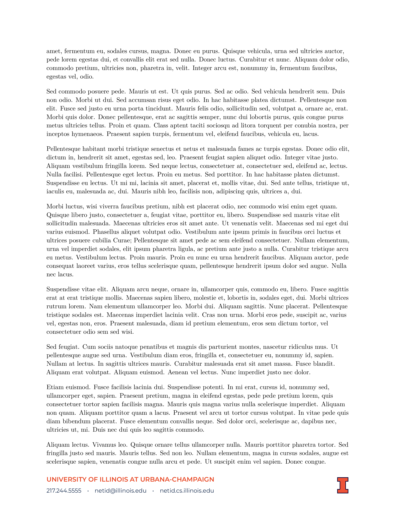

## What is this

This is an attempt to reproduce the Illinois letterhead in Latex using the new brand, the [block-I](https://marketing.illinois.edu/design/logo).

The official [typogrophy] recommendation is the
[Montserrat](https://ctan.org/tex-archive/fonts/montserrat?lang=en) font,  used
here and included in TexLive.  The main text defaults to Montserrat,
but the body can be easily changed.

## How to use

Copy (or link) the `illinois-letterhead.sty` and `.pdf` logo files to your working directory.  In addition, you will need `sig.png` or some other signature if you plan to use one.  Then start with `template.tex` and modify.

The following commands are optional:

| Command                      | Description                               |
| :------                      | :------                                   |
| `\fromdept{<text>}`          | Department name                           |
| `\fromdeptaddress{<text>}`   | Department address                        |
| `\fromtel{<text>}`           | Phone number (footer)                     |
| `\fromemail{<text>}`         | Email address (footer)                    |
| `\fromweb{<text>}`           | URL (footer)                              |
| `\fromname{<text>}`          | From name (closing)                       |
| `\closing{<text>}`           | Closing text (e.g. `Sincerely,`, closing) |
| `\signaturefile{<filename>}` | Signature file (closing)                  |

### How to use, writing many letters

Script [startletter.sh](./startletter.sh) is simple script that can create a directory
for each letter. For example,
```bash
./startletter.sh some_topic_2024
```
will create
```
some_topic_2024
├── illinois-letterhead.sty
├── Illinois-Logo-Full-Color-CMYK.pdf
├── Illinois-Wordmark-Horizontal-Full-Color-CMYK.pdf
├── sig.png
└── some_topic_2024.tex
```

Each letter is then self-contained to a directory.
Replace `sig.png` and/or modify the script.


## What it looks like

[full pdf](./example/example.pdf)



## Details

You can see details by using the layout option: `\usepackage[layout]{illinois-letterhead}`.  Setting this shows the measurements similar to [here](https://creativeservices.illinois.edu/brand/pdf/stationery/letterhead.pdf).





## Other versions (not maintained)

- [`imark` branch](https://github.com/lukeolson/illinois-letterhead/tree/imark): the *old* I-mark style.
- [`blocki-basic` branch](https://github.com/lukeolson/illinois-letterhead/tree/blocki-basic): the non space-saving original version of this template in the block-I format.
- [`blocki-nonpackage` branch](https://github.com/lukeolson/illinois-letterhead/tree/blocki-nonpackage): uses `\input{}` instead of `\usepackage{}`
