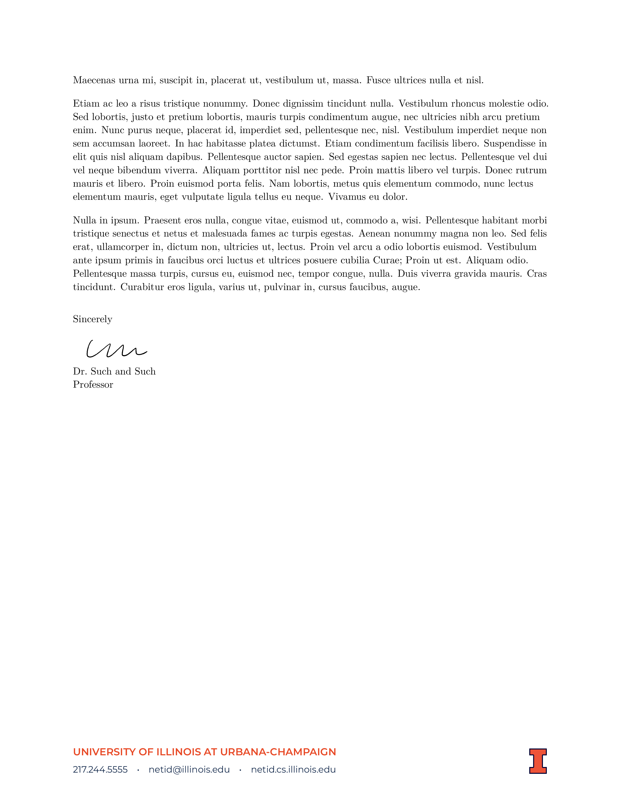

## What is this

This is an attempt to reproduce the Illinois letterhead in Latex.  This uses the new brand, the [block-I](http://creativeservices.illinois.edu/brand/).

This the *space-saving* format outline [here](https://creativeservices.illinois.edu/brand/pdf/stationery/letterhead.pdf).

The official letterhead appears to use the [Gotham](https://www.typography.com/fonts/gotham/overview/) font.  A close available alternative is the [Montserrat](https://ctan.org/tex-archive/fonts/montserrat?lang=en) font, which is used here and is included in TexLive.

## How to use

Copy (or link) the `illinois-letterhead.sty` and `.pdf` logo files to your working directory.  In addition you will need `sig.png` or some other signature if you plan to use one.  Then start with `template.tex` and modify.

## What it looks like

[full pdf](./example/example.pdf)

## Details

You can see details by using the layout option: `\usepackage[layout]{illinois-letterhead}`.  Setting this shows the measurements similar to [here](https://creativeservices.illinois.edu/brand/pdf/stationery/letterhead.pdf).

## Other versions (not maintained)

- [`imark` branch](https://github.com/lukeolson/illinois-letterhead/tree/imark): This is the *old* I-mark style.
- [`blocki-basic` branch](https://github.com/lukeolson/illinois-letterhead/tree/blocki-basic): This is this is the non space-saving original version of this template in the block-I format.
- [`blocki-nonpackage` branch](https://github.com/lukeolson/illinois-letterhead/tree/blocki-nonpackage): This branch uses `\input{}` instead of `\usepackage{}`
